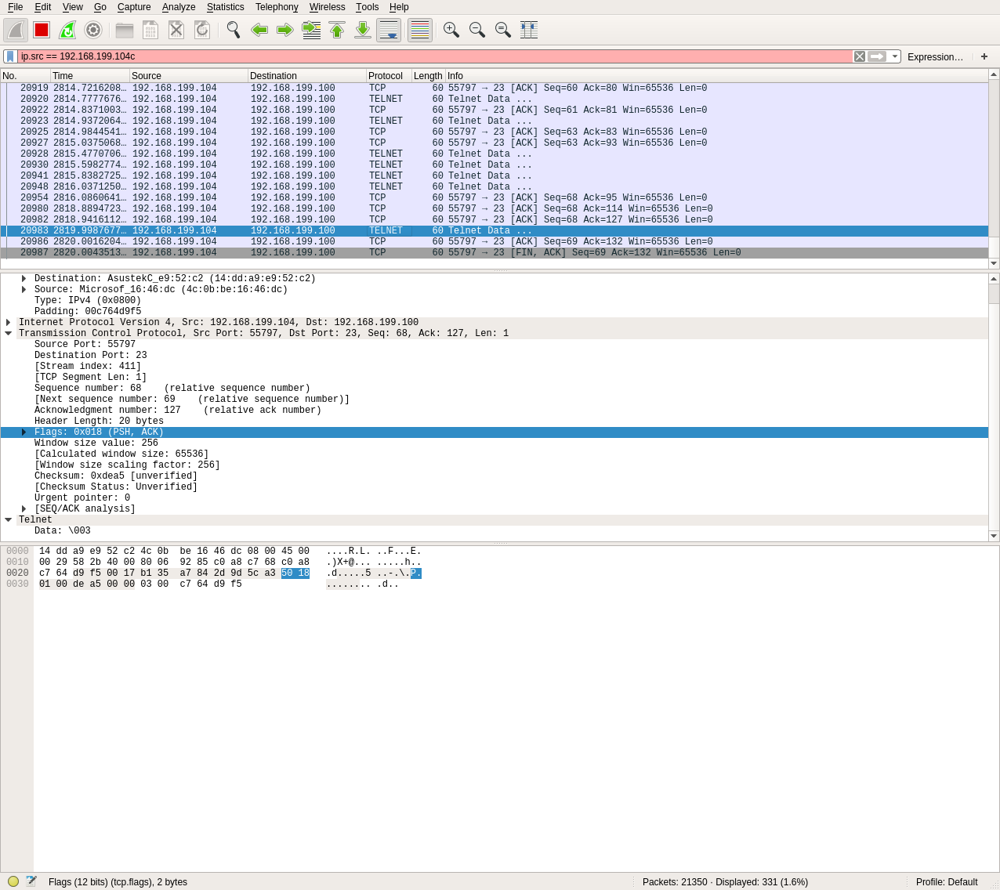
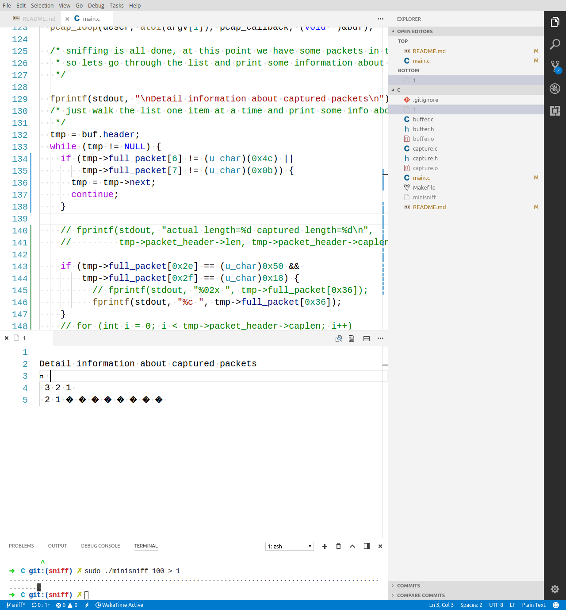

# Sniff
`jskyzero` `2017/11/26`

## Overview

minisniff is a mini sniff that capture package and show some info about the package.

## Install & Run
1. Fitst Install Dependence `sudo apt-get install libpcap0.8-dev`

2. Try to Make it `make`

3. Run as `sudo ./minisniff 2` to capture 2 package

## Question & Answer

1. What library does minisniff use to capture packets? Where in the web can you find more information about this library?

	libpcap: a portable C/C++ library for network traffic capture.

	official web site: http://www.tcpdump.org/

2. Do some research and describe the advantages/disadvantage of using this library? Do not blindly copy and paste material from the web. Try to understand the material you find and write what you understood.

	advantages: 隔离底层细节，提供上层接口方便使用/利用操作系统提供的过滤机制，减少资源开销
	disadvantage： 是 C/C++ 的库，受限于编程语言的局限性。

3. Are there any alternative libraries available to capture packets? (Open source only)

	+ [pcap4j A Java library for capturing, crafting, and sending packets](https://github.com/kaitoy/pcap4j)
	+ [libtins packet crafting and sniffing library](https://github.com/mfontanini/libtins)

4. Explain the purpose of the following functions:
	+ pcap_lookupdev: locating the network card(find the default device on which to capture)
	+ pcap_open_live: open the network card to sniff(open a device for capturing)
	+ pcap_lookupnet: find the IPv4 network number and netmask for a device
	+ pcap_compile: compile a filter expression
	+ pcap_setfilter: pcap_setfilter - set the filter
	+ pcap_next: read the next packet from a pcap_t
	+ pcap_loop: read the network card and returns numbers of packets captured
	+ pcap_dispatch: process packets from a live capture or savefile

5. There are five layers in the TCP/IP stack (application, transport, network, link, and physical). Up to what layer can minisniff decode data from the captured
packets? Justify your answer using the code.

	从运行时候的mac address可以推测是在数据链路层，在manpage中也有说明：`... probably includes a link-layer header...`


## telnet

+ I have windows 10 and linux OS, It seems that windows 10 don't have the unsafe telnet server, I use Linux as the server, you can find how to install it on internet.

+ linux server : `sudo /etc/init.d/xinetd start`, then windows client `telnet 192.168.199.100`, you can open wireshark to capture package.

+ use wireshark to analysis which bytes is passworld and should disply



图上是判断flag字段，处理的方法十分简单粗暴，判断mac地址保留client的包，然后判断flag字段保留Telnet包，然后打印对于字段。

+ then compile and run and output ans.


由于捕捉到包以后是逆序输出所以实际上是12 / 123，不可见字符是因为打印太暴力了。

## Original Readme

```
		readme file for minisniff
		-------------------------
i don't think i need to tell you this but i'll tell it anyway, minisniff is written for you to experiment with the source code for network security classes CS393/CS682. DO NOT USE this sniffer outside our security testbed in isis lab.

so, this is a sample code for how to start writing a sniffer. i hope this answers most of your questions about how hard/easy it is to capture packets off the wire and how to write a sniffer etc. you need to download and install pcap (packet capture) library on your machine to compile the sniffer. you can download pcap from http://www.tcpdump.org/ once you install the pcap library all you need to do is type 'make' in the directory where you have this README file, so that the files can be compiled. there shouldn't be errors or warnings, if so email me the errors, copy-paste them, don't even attempt to describe the errors on your own words:-) 

if you just want to run the sniffer and see what it does use the compiled 'minisniff' file that comes with this file, then you don't need pcap library, but the file is compiled on Linux (i-386, ELF) so obviously it wont work on other operating systems. you should be able to execute the sniffer by typing './minisniff 20' to capture and display information about 20 packets.

feel free to modify the code and enhance the sniffer as you please. drop me a line if you need any help, but i don't guarantee that i'd be able to help you.
```

## Reference
+ [Programming with pcap](https://www.tcpdump.org/pcap.html)
